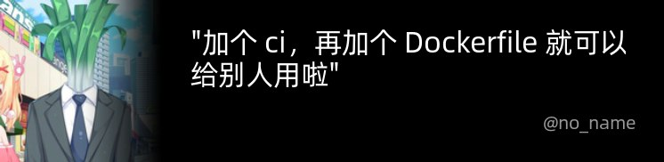

# make-it-a-quote-tg
一个把被你回复的消息变成图片的 Bot

效果图:  


## 如何部署？
首先把镜像拉下来
```shell
docker pull ghcr.io/lemonnekogh/make-it-a-quote-tg:latest
```
然后运行
```shell
docker run --name <容器名称> \
  -d -it \
  -e BOT_TOKEN=<你的 Bot 接口令牌> \
  -e NOTIFY_CHAT_ID=<启动时要提醒的对话 id> \
  --restart always \
  lemonnekogh/make-it-a-quote-tg
```
加上 `--restart always` 是为了在容器挂掉之后重新启动，不需要的话，去掉就好了
## TodoList
- [x] 在收到转换指令后，进行一个友好的回复，避免被误认为卡住了
- [x] 支持 `gray` 参数，收到这个参数时，头像会被处理成灰色
- [ ] 使用 `semantic-release` 语义化镜像版本
- [ ] 支持把消息转发给 bot 来生成图片
- [ ] 添加 `/start` 命令，提示使用方法
- [ ] README：添加 Bot 使用方法
- [x] 支持选择引号类型
- [ ] 支持自定义字体，参数中需要传入字体链接
- [ ] 当消息是转发消息时，获取来源